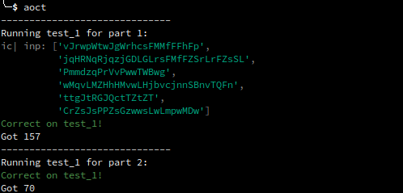
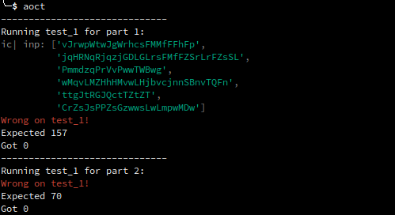

# Advent of code tester
A simple program that checks your AOC solution against the provided test cases.

## Example

Here are screenshots of running the program.
Notice how the debug logs from [icecream](https://github.com/gruns/icecream) get printed too.





## How to

To run the tests, simply execute the command:
``` shell
aoct
```

You can run it for a specific part:
``` shell
aoct 1
aoct 2
```

## Requirements

For this to work its magic, you must satisfy two requirements:
1. Your solution takes input from `stdin` and outputs solution to `stdout`.
2. The test files are named according to a specific scheme.

### Solution template

The solution file must be named `main.py`.

You can use this template for your solution script:

``` python
def p1(int):
    return 0

def p2(int):
    return 0

if __name__ == "__main__":
    import sys
    inp = sys.stdin.read().strip()
    
    # optional
    if not 'test' in sys.argv:
        ic.disable()

    if '2' not in sys.argv:
        print(p1(inp))
    if '1' not in sys.argv:
        print(p2(inp))
```

Basically, `aoct` will invoke your solution script with two arguments: 
problem part (`1` or `2`) and the argument `test`.

By providing the `test` argument,
`aoct` allows you to optimize your own program when you want to run it on the big input.
For example, if you're using a logger,
you can disable it if the argument isn't given 
to avoid wasting performance on formatting those logs.
## Test cases
Your files should be named like this:
``` text
Problem_directory
├── main.py
├── test_1.1.out
├── test_1.2.out
└── test_1.in
├── test_2.2.out
└── test_2.in
```

For tests, this is sorta the naming scheme:
- for test input: `test*.in`
- for expected output in part 1: `test*.1.out`
- for expected output in part 2: `test*.2.out`

For example, for [AOC 2022 day 3](https://adventofcode.com/2022/day/3), you would have the following test files:

`test_1.in`
``` text
vJrwpWtwJgWrhcsFMMfFFhFp
jqHRNqRjqzjGDLGLrsFMfFZSrLrFZsSL
PmmdzqPrVvPwwTWBwg
wMqvLMZHhHMvwLHjbvcjnnSBnvTQFn
ttgJtRGJQctTZtZT
CrZsJsPPZsGzwwsLwLmpwMDw
```

`test_1.1.out`
``` text
157
```

`test_1.2.out`
``` text
70
```
